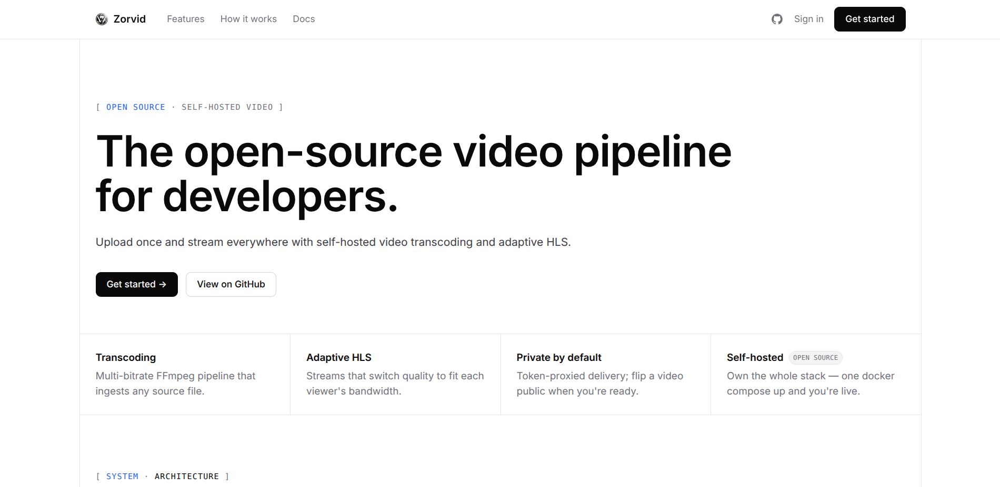

# 🎬 Video Processing Pipeline



A self-hosted **video-on-demand platform**: upload a video, watch it get transcoded
into **adaptive HLS** in the background, then stream it with automatic quality
switching. Built to be **decoupled and horizontally scalable** — every component can
move to its own host without a rewrite.

> Upload → queue → FFmpeg transcode (360p/480p/720p) → adaptive HLS → CDN-cacheable streaming.

---

## ✨ Features

- **Drag-and-drop upload** with live upload progress (React SPA).
- **Background transcoding** to a multi-bitrate H.264 / HLS ladder via FFmpeg workers.
- **Live job progress** — status walks `pending → analyzing → transcoding → … → completed`, polled in real time.
- **Adaptive playback** with hls.js (auto ABR + manual quality selection).
- **Public & private videos** — public streams are CDN-cacheable; private streams require a short-lived, per-stream token attached to every request.
- **JWT auth** with argon2-hashed passwords; per-user ownership enforced.
- **Resilient** — BullMQ retries with backoff, persisted job state + logs, idempotent stages.
- **Horizontally scalable** — add workers with `--scale worker=3`; stateless API; object storage.

## 🏗️ Architecture

```
Browser (React SPA + hls.js)
        │
     ┌──▼───┐  serves SPA, proxies /api, caches public HLS
     │ nginx │
     └─┬───┬─┘
  /api │   │ /api/videos/:id/hls/*  (HLS, public = cached)
   ┌───▼──┐│
   │ API  ││  Fastify (TS): auth, upload, CRUD, enqueue, signed streaming
   └─┬──┬─┘│
enqueue│  │ read/write
   ┌───▼┐ └──────┐
   │Redis│   ┌───▼────┐
   │BullMQ│  │Postgres│  users, videos, jobs, progress
   └──┬──┘   └────────┘
      │ pull job
 ┌────▼─────┐ upload outputs ┌────────┐
 │ Workers  │───────────────▶│ MinIO  │  inputs / outputs (HLS) / thumbnails
 │ (FFmpeg) │                └────────┘
 └──────────┘
```

Full design notes: [`docs/architecture.md`](docs/architecture.md) ·
build walkthrough: [`docs/steps.md`](docs/steps.md).

### Streaming & privacy (design note)

All HLS bytes are served **through the API**, not via presigned MinIO URLs. hls.js
fetches nested child playlists/segments with *relative* URLs, which would drop any
query-string signature — so presigning only ever loads the master playlist. Instead:

- **Public** videos: served anonymously with `Cache-Control: public, immutable` → cached by nginx / Cloudflare.
- **Private** videos: kept in a private bucket; the player attaches a short-lived stream token (`SIGNED_URL_TTL`) on *every* request via hls.js `xhrSetup`, and responses are `no-store`.

## 🧰 Tech stack

| Layer | Tech |
|---|---|
| Frontend | **React + TypeScript + Vite**, hls.js |
| API | **Node.js + TypeScript + Fastify** |
| Queue / workers | **Redis + BullMQ**, **FFmpeg** |
| Storage | **MinIO** (S3-compatible) |
| Database | **PostgreSQL** |
| Gateway / CDN | **nginx** + Cloudflare (edge cache) |

## 🚀 Quick start (Docker)

```bash
cp .env.example .env        # then edit secrets
docker compose up -d --build
# open http://localhost:8080
```

This brings up Postgres, Redis, MinIO, the API, a worker, and nginx (which builds and
serves the React SPA). Migrations run automatically via a one-shot `migrate` service
before the API starts. Scale transcoding with:

```bash
docker compose up -d --scale worker=3
```

## 🛠️ Local development (without Docker)

You need Postgres, Redis, and MinIO running (and `ffmpeg`/`ffprobe` on PATH for the worker).

```bash
npm install
npm run build --workspace @vp/shared

# API + worker (separate terminals)
npm run migrate --workspace @vp/api
npm run dev:api
npm run dev:worker

# React app (proxies /api → http://localhost:3000)
cd packages/web && npm install && npm run dev   # http://localhost:5173
```

## ✅ Tests

API integration tests (auth, video CRUD, streaming authorization) run against real
Postgres/Redis/MinIO and drive Fastify via `app.inject`:

```bash
npm run test --workspace @vp/api
```

CI ([`.github/workflows/ci.yml`](.github/workflows/ci.yml)) spins up those services,
builds every package, runs migrations, runs the tests, and builds the SPA on each push/PR.

## 📁 Project structure

```
packages/
  shared/   # shared TS types/enums (Video, Job, queue contract)
  api/      # Fastify: auth, upload, CRUD, streaming, BullMQ producer, migrations
  worker/   # BullMQ consumer: FFmpeg analyze → transcode → thumbnails → package → finalize
  web/      # React + Vite SPA (auth, upload, progress, hls.js player)
nginx/      # gateway: SPA + /api proxy + public-HLS cache
docs/       # architecture.md, steps.md
```

## 🗺️ Roadmap

Planned enhancements (tracked for the hosted deployment):

- **SSE/WebSocket** progress instead of polling.
- **Prometheus `/metrics`** (queue depth, jobs processed, transcode duration).
- **Graceful worker shutdown** + readiness/liveness probes.
- **Cache purge-on-revoke** (Cloudflare API) when a video flips public → private.
- **Rate limiting** + request-schema validation.

> **Note on revocation:** flipping a video public → private does not retroactively
> evict already-cached copies for the cache TTL — an inherent CDN property, addressed
> by the purge-on-revoke item above.
