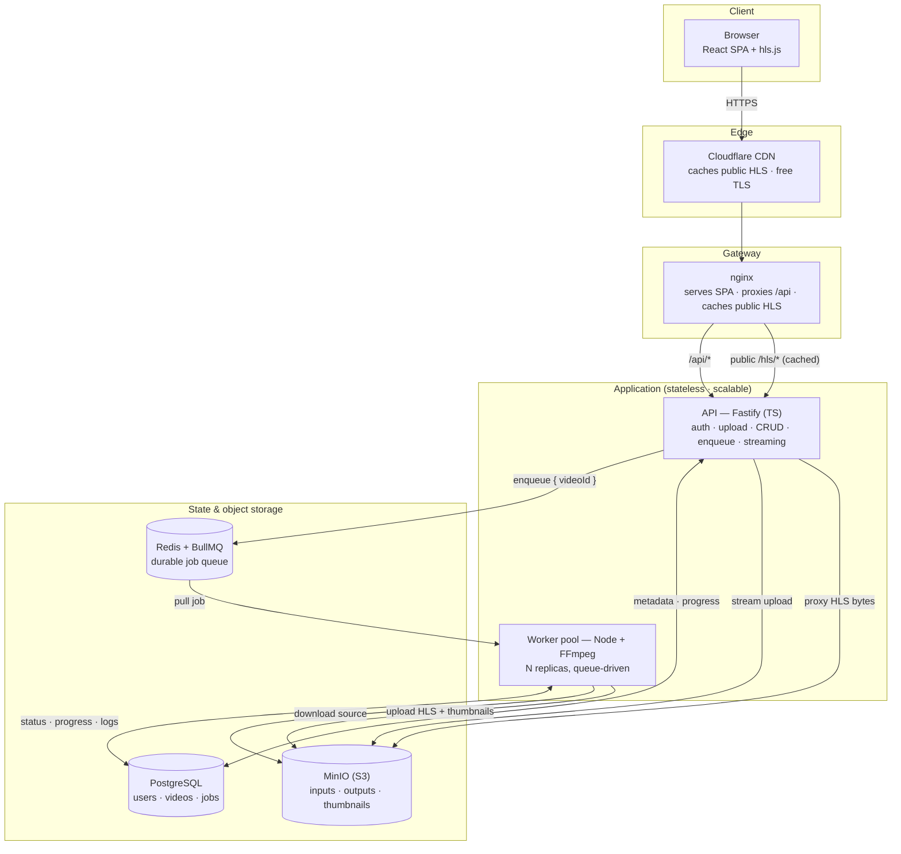
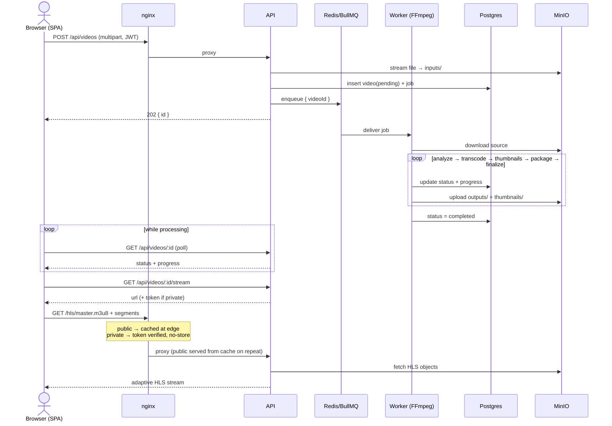

# Architecture — Video Processing Pipeline

A self-hosted **video-on-demand (VOD)** platform: users upload videos, the system transcodes
them into adaptive HLS streams, and viewers stream them on demand. Built hobby-scale but
**decoupled and horizontally scalable** — every component can move off the single VPS to its
own host without a rewrite.

---

## 1. Design goals

| Goal | How it's met |
|---|---|
| Handle high upload/processing volume | Queue-driven workers (BullMQ) absorb CPU-heavy transcoding; scale by adding worker replicas |
| Endless / smooth streaming | Adaptive HLS (multi-bitrate) + CDN edge caching |
| Scale on a single VPS now | Everything in Docker Compose; each service is independently scalable |
| No rewrite to scale out later | Stateless API, object storage (S3-compatible), external queue/DB |
| Robust under failure | Job retries with backoff, persisted job state + logs, idempotent stages |

---

## 2. Tech stack

| Layer | Choice | Why |
|---|---|---|
| API | **Node.js + TypeScript + Fastify** | fast, typed, low-boilerplate HTTP + multipart |
| Queue | **Redis + BullMQ** | durable jobs, retries, backoff, concurrency control |
| Workers | **Node + TS + FFmpeg** | reuse types/code with API; FFmpeg does the heavy lifting |
| Object storage | **MinIO** (S3-compatible) | decouples storage from compute; swap to S3/R2 by config only |
| Database | **PostgreSQL** | relational state for users, videos, jobs |
| Gateway | **nginx** | TLS termination, reverse proxy, static/stream routing |
| CDN | **Cloudflare (free tier)** | edge-cache HLS segments, absorb viewer load, free TLS |
| Player | **hls.js** | adaptive HLS playback in any browser |

---

## 3. System diagram

### Components & data flow



### Request lifecycle (upload → watch)



---

## 4. Components

| Component | Responsibility |
|---|---|
| **nginx (gateway)** | TLS, route `/api` → API, route `/streams` → MinIO, gzip |
| **API service** | auth, uploads, CRUD, enqueue jobs, sign stream URLs, progress endpoints |
| **Redis + BullMQ** | durable job queue, retries, backoff, concurrency limits |
| **Workers** | run FFmpeg stages, update progress/status, upload outputs |
| **MinIO** | object storage buckets: `inputs`, `outputs` (HLS), `thumbnails` |
| **PostgreSQL** | `users`, `videos`, `jobs` |
| **Cloudflare** | edge-cache HLS segments, free TLS |

---

## 5. Data flow

1. **Upload** — `POST /api/videos` (multipart, JWT). API streams the raw file into MinIO
   `inputs/`, inserts a `videos` row (`status=pending`) + a `jobs` row, enqueues a BullMQ job,
   returns immediately.
2. **Transcode** — a worker pulls the job, downloads the source to a temp dir, runs FFmpeg
   stages, uploads results to MinIO `outputs/`, updates `progress`/`status` per stage.
3. **Status** — client polls `GET /api/videos/:id` (or SSE) for live progress.
4. **Stream** — when `completed`, the client calls `GET /api/videos/:id/stream` to get the
   playback URL. All HLS bytes are proxied through the API (`/api/videos/:id/hls/*`) from a
   private outputs bucket: **public** videos are served anonymously with long-lived
   `Cache-Control` (nginx/Cloudflare cache them at the edge); **private** videos require a
   short-lived per-stream token that hls.js attaches to every request via `xhrSetup`, and are
   served `no-store`. (Presigned MinIO URLs are intentionally avoided — hls.js resolves child
   playlists/segments with relative URLs, which would drop the signature.)

### FFmpeg stages (per job)
| # | Stage | Tool | Progress |
|---|---|---|---|
| 1 | Analyze (codec/res/duration/bitrate) | `ffprobe` | →5% |
| 2 | Transcode H.264 ladders (360p/480p/720p, capped at source) | `ffmpeg` | 10%→70% |
| 3 | Thumbnails (6 evenly-spaced frames) | `ffmpeg` | 70%→85% |
| 4 | HLS packaging (6s `.ts` segments + per-rendition `.m3u8` + master playlist) | `ffmpeg` | 85%→98% |
| 5 | Upload outputs, mark `completed` | — | 100% |

Progress for stage 2 is parsed live from FFmpeg stderr (`time=hh:mm:ss.xx` ÷ total duration).

---

## 6. Data model (PostgreSQL)

**users**
- `id` uuid (pk), `email` (unique), `password_hash` (argon2/bcrypt), `created_at`

**videos**
- `id` uuid (pk), `user_id` (fk), `title`, `original_filename`
- `status` enum: `pending|analyzing|transcoding|thumbnails|packaging|completed|failed`
- `visibility` enum: `private|public`
- `metadata` jsonb (height, width, duration, codecs, bitrate)
- `master_playlist_key`, `created_at`

**jobs**
- `id` uuid (pk), `video_id` (fk), `progress` (0–100), `stage`
- `logs` text (append-only FFmpeg output), `error_message`, `attempts`, `updated_at`

---

## 7. Scalability strategy

- **Stateless API** — multiple replicas behind nginx; no in-process job state.
- **Queue decoupling** — uploads never block on CPU; queue depth provides natural backpressure.
- **Independently scalable workers** — add worker containers for more throughput
  (`docker compose up --scale worker=3`); later, a second machine pointing at the same Redis.
- **Object storage, not local disk** — any node serves any video; swap MinIO → S3/R2 by config.
- **CDN offload** — Cloudflare serves cached segments; viewers scale with the edge, not origin.
- **Graceful failure** — BullMQ retries with backoff; failed jobs surface `error_message` + logs.

> **Cloudflare caveat (honest note):** Cloudflare's *free* plan technically restricts caching
> large volumes of non-HTML content like video (ToS 2.8). Fine at hobby scale and the standard
> free pick; the clean growth path is **Cloudflare R2 + Cloudflare CDN** (free egress, free tier).
> Since MinIO is S3-compatible, that migration is config-only.

---

## 8. Security

- JWT access tokens; passwords hashed with argon2/bcrypt.
- Per-user video ownership enforced in the API.
- Private videos served via the API HLS proxy, gated by **short-lived, per-stream tokens**
  (TTL = `SIGNED_URL_TTL`) attached to every request; private responses are `no-store`.
- nginx terminates TLS; secrets injected via `.env` (never committed).

---

## 9. Repository layout

```
video_processing/
├─ docker-compose.yml        # nginx, api, worker, migrate, redis, postgres, minio
├─ .env                      # secrets, bucket names, JWT secret, DB url
├─ nginx/nginx.conf
├─ .github/workflows/ci.yml  # build + test + SPA build on push/PR
├─ packages/
│  ├─ api/                   # Fastify app
│  │  ├─ src/routes/         # auth, videos, streams
│  │  ├─ src/auth/           # JWT helpers
│  │  ├─ src/storage/        # MinIO (S3) client wrapper
│  │  ├─ src/db/             # Postgres client + migrations
│  │  ├─ src/queue/          # BullMQ producer
│  │  └─ test/               # integration tests (app.inject)
│  ├─ worker/                # BullMQ consumer
│  │  ├─ src/stages/         # analyze, transcode, thumbnails, package
│  │  └─ src/ffmpeg/         # subprocess wrapper + progress parser
│  ├─ shared/                # shared TS types (Video, Job, enums)
│  └─ web/                   # React + Vite SPA (auth, upload, progress, hls.js player)
└─ docs/                     # architecture.md, steps.md
```

Run the whole stack on the VPS with: `docker compose up -d`.

---

## 10. Out of scope (deferred)

- Live (RTMP) ingest — VOD only.
- DRM / encrypted HLS — signed URLs only for now.
- Per-user storage quotas and rate limiting.
- Managed S3/R2 + multi-node workers — config-only path already designed in.
